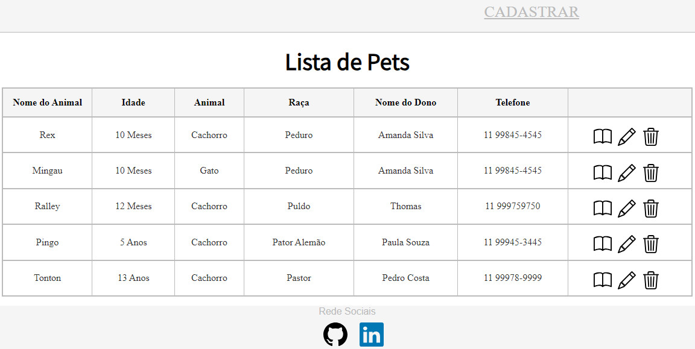

# Projeto desenvolvido com

Este Projeto onde é possivel listar, visualizar, criar, editar, excluir animais de estimação de uma petshop.

 

  

## Site do Projeto

https://front-back-petshop.vercel.app/

## Repositorio do Projeto

https://github.com/JacquelineCasali/Front--Back--Petshop

## Instalação

## FRONTEND

1. `$ cd pet`
2. `$ npm install`
3. `$ npm start`

## BackEnd

`$ cd server`
`$ npm install`
`$ npm run dev`

## BackEnd

- Cria pet no banco de dados
- Ler pet no banco de dados
- Atualizar pet no banco de dados
- Excluir pet no banco de dados
- Clique no cartão para editar e excluir

## Bibliotecas Usadas

## FRONTEND

-- `Axios`
-- `React.js`
-- `Bootstrap`

## BackEnd

- `Express`
- `PostgreSQL`
- `Node.js`
- `cors `
- `nodemon`
